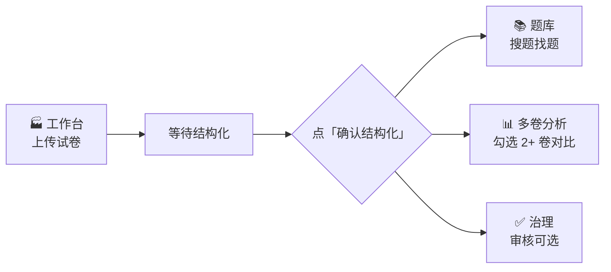

# 试卷考点拆解助手 · exam-agent

> **上传试卷 → 自动拆题、对齐考点 → 生成练习 → 搜题、比卷、管题库**  
> 面向老师与教研的 AI 备课助手，把「卷子」变成可复用的「题资产」。

<p align="center">

[](https://www.python.org/)
[](https://react.dev/)
[](https://fastapi.tiangolo.com/)
[](https://github.com/zhaoyixuanyxz/exam-agent)

</p>

---

## 你能用它做什么？

| 需求 | 系统帮你 |
|------|----------|
| 手里有一套 PDF/Word 试卷，想快速拆成单题 | 上传 → 结构化拆题 |
| 想知道每题考什么、怎么讲 | 考点分析 + 说明文档 |
| 想按考点给学生出分块练习 | 一键生成练习 PDF |
| 以前拆过的题想再找到 | **题库** 关键词搜索 |
| 两套卷想比考点差异 | **多卷分析** 对比报表 |
| 题库要长期维护、有人把关 | **治理** 审核题目状态 |

> 💡 **一句话**：工作台负责「生产题目」；题库负责「找题」；多卷分析负责「比卷」。

---

## 5 分钟上手（Windows）

### ① 准备两样东西

- **Python 3.11+** 和 **Node.js 18+**（[python.org](https://www.python.org/) · [nodejs.org](https://nodejs.org/)）
- **DeepSeek API Key**（[platform.deepseek.com](https://platform.deepseek.com) 申请，形如 `sk-...`）

### ② 配置密钥（只需做一次）

```powershell
# 在 exam-agent 根目录
copy .env.example backend\.env
# 用记事本打开 backend\.env，填入：
# DEEPSEEK_API_KEY=你的密钥
```

### ③ 一键启动

**双击** `start.bat`，或在 PowerShell 中：

```powershell
powershell -ExecutionPolicy Bypass -File .\start.ps1
```

浏览器会自动打开 **http://127.0.0.1:5173**  
API 文档：**http://127.0.0.1:8000/docs**

> ⚠️ 首次启动会自动安装依赖，可能需要几分钟。  
> 关掉了？重新双击 `start.bat` 即可。

---

## 给他人使用 · 方案 A（推荐）

**你托管，同事只开浏览器** — 不用装 Python、不用自己申请 API Key。

| 你是谁 | 做什么 |
|--------|--------|
| **管理员（你）** | 双击 **`start-shared.bat`** → 用 Tailscale 或 Cloudflare 隧道发链接 |
| **使用者（老师）** | 打开链接 → 顶栏「操作指南」按流程用 |

📖 完整步骤 → **[docs/plan-a-shared-hosting.md](docs/plan-a-shared-hosting.md)**

```text
快速试点（对方零安装）：
  1. start-shared.bat
  2. scripts\start-cloudflare-tunnel.ps1
  3. 把 https://xxx.trycloudflare.com 发给同事
```

---

## 界面长什么样？五个 Tab 够用

```
┌─────────────┬─────────────┬─────────────┬─────────────┬─────────────┐
│  🏭 工作台   │  📊 多卷分析 │  📚 题库     │  ✅ 治理     │  👥 组织     │
│  上传拆题    │  两卷对比    │  搜已入库题  │  审核题目    │  换用户/审计  │
└─────────────┴─────────────┴─────────────┴─────────────┴─────────────┘
```

| Tab | 你可以把它理解成… | 日常要不要进 |
|-----|-------------------|--------------|
| **工作台** | 加工车间：上传、拆题、分析、出练习 | ✅ 必用 |
| **多卷分析** | 对比报表：至少两套已拆好的卷做对比 | 比卷时用 |
| **题库** | 成品货架：搜已经落库的题目 | 找题时用 |
| **治理** | 质检台：改题目审核状态 | 可选 |
| **组织** | 换身份、看操作记录 | 一般可忽略 |

顶栏还有 **「操作指南」**，和产品内帮助页内容一致。

---

## 推荐流程（第一次用，照做就行）



### 场景 A · 只想把卷子变成能搜到的题

```
工作台上传 → 等结构化 → 点「确认」 → 去「题库」搜一搜
```

### 场景 B · 两套卷比考点差异

```
两卷都在工作台分别「结构化 + 确认」 → 「多卷分析」勾选两卷 → 运行
```

> 📌 **关键一步**：没在工作台点 **「确认结构化」**，题目不会正式进库——后面题库和多卷分析都会是空的。

---

## 支持哪些输入？

| 方式 | 说明 |
|------|------|
| PDF | 常见试卷扫描件 / 电子版 |
| Word (.docx) | 可编辑卷面 |
| 粘贴网址 | 抓取网页正文 |
| 粘贴文字 | 直接贴题干 |

单文件默认上限 **50MB**。对话里还可以让助手生成 **考点说明 Markdown**、**分块练习 PDF** 等，在界面里下载。

---

## 遇到问题？先看这张表

| 你看到的 | 多半是因为 | 怎么办 |
|----------|------------|--------|
| 题库是空的 | 还没点「确认结构化」 | 回工作台，对试卷点确认 |
| 多卷分析说卷不够 2 份 | 同一会话里确认过的卷不足 2 份 | 再确认一份，或减少筛选 |
| 治理里没有题 | 暂无待审核状态的题 | 正常，有题沉淀后会出现 |
| 启动后页面打不开 | 后端还没起来 / 端口被占 | 等 1～2 分钟；或看 [DEV_RUNBOOK.md](DEV_RUNBOOK.md) |
| 模型调用失败 | `DEEPSEEK_API_KEY` 没填或填错 | 检查 `backend/.env` 后重启 |

更详细的排障 → [DEV_RUNBOOK.md](DEV_RUNBOOK.md)

---

## 项目结构（给开发者）

```
exam-agent/
├── start.bat / start.ps1    ← 一键启动（老师用这个就够）
├── backend/                 ← FastAPI + Agent + SQLite
├── frontend/                ← React 工作台界面
├── docs/                    ← 产品文档与操作指南
│   └── 用户操作指南.md
└── data/                    ← 本地数据（不上传 Git）
```

---

## 更多文档

| 文档 | 适合谁 |
|------|--------|
| [docs/用户操作指南.md](docs/用户操作指南.md) | 老师 / 教研 — Tab 怎么用、常见坑 |
| [docs/plan-a-shared-hosting.md](docs/plan-a-shared-hosting.md) | 管理员 — 托管给他人、发链接 |
| [DEV_RUNBOOK.md](DEV_RUNBOOK.md) | 开发者 — 环境、依赖、排障 |
| [docs/需求文档.md](docs/需求文档.md) | 产品 — 功能范围 |
| [docs/V2_3_audit_and_acceptance.md](docs/V2_3_audit_and_acceptance.md) | 验收 — API 与测试 |

---

<p align="center">

**试卷进系统，考点看得见，练习出得来，题目找得到。**

<sub>V2.3 · 题库 / 多卷分析 / 治理 / 组织</sub>

</p>
