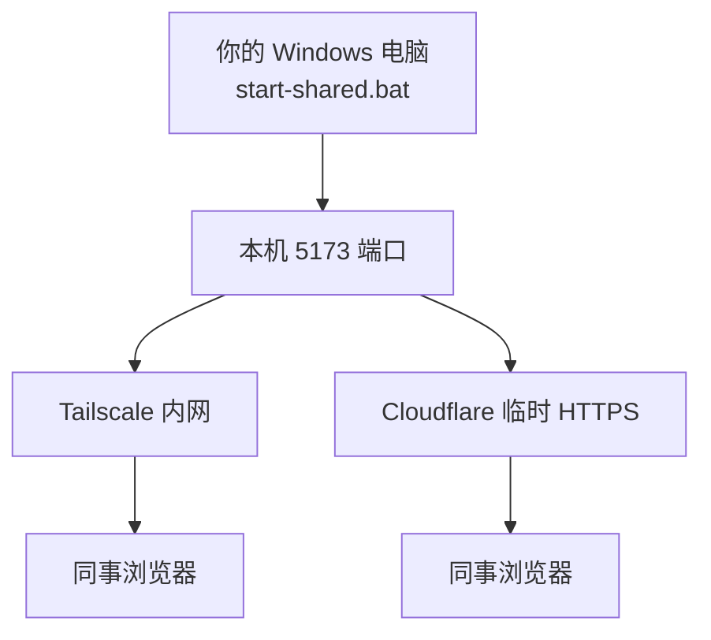

# 方案 A：你托管，别人浏览器打开就用

> **管理员**在一台电脑上常开服务；**使用者**只需浏览器 + 一个链接，不用装 Python、不用配 API Key。

---

## 谁做什么？

| 角色 | 要做的事 | 不需要做 |
|------|----------|----------|
| **你（管理员）** | 配好 `backend/.env`、双击 `start-shared.bat`、发链接 | — |
| **老师 / 同事（使用者）** | 打开链接，按 [用户操作指南](用户操作指南.md) 用 | 装 Python、Node、Git、DeepSeek 账号 |



---

## 管理员：第一次准备（约 10 分钟，只做一次）

### 1. 确认本机已能自用

```powershell
# 普通模式先跑通一次
双击 start.bat
# 浏览器能打开 http://127.0.0.1:5173 即可
```

### 2. 配置 API 密钥（全组共用一把）

```powershell
copy .env.example backend\.env
# 记事本打开 backend\.env，填入：
# DEEPSEEK_API_KEY=sk-xxxxxxxx
```

> 💡 **费用**：DeepSeek 按调用计费，建议管理员统一充值、定期看余额。

### 3. 启动「共享模式」

```powershell
双击 start-shared.bat
```

与 `start.bat` 的区别：前端监听 **0.0.0.0:5173**，局域网 / 隧道可以连进来；后端仍在 **127.0.0.1:8000**（仅本机，由 Vite 转发 API，外人碰不到 8000 端口）。

**保持两个 PowerShell 窗口不要关**（Backend + Frontend）。

---

## 把链接发给同事：二选一

### 路径 1 · Tailscale（推荐：教研组长期用，较安全）

适合：同一学校 / 教研组，愿意每人装一个小软件（约 5 分钟）。

| 步骤 | 操作 |
|------|------|
| 1 | 管理员与同事都去 [tailscale.com](https://tailscale.com/download) 下载 Windows 版，**登录同一账号或同一 Tailnet** |
| 2 | 管理员本机运行 `start-shared.bat` |
| 3 | 管理员查看本机 Tailscale IP：任务栏 Tailscale 图标 → 或 PowerShell 执行 `tailscale ip -4` |
| 4 | 把链接发给同事：`http://100.x.x.x:5173`（把 IP 换成你的） |

> 📌 同事也要装 Tailscale 并登录，才能打开 `100.x.x.x` 这种地址。  
> 优点：不暴露公网、流量加密。缺点：每人装一次 Tailscale。

---

### 路径 2 · Cloudflare 临时隧道（推荐：对方零安装、快速试点）

适合：临时演示、外校老师、不想让人装 Tailscale。

| 步骤 | 操作 |
|------|------|
| 1 | 管理员安装 cloudflared：`winget install Cloudflare.cloudflared` |
| 2 | 先运行 `start-shared.bat`，等页面本地能打开 |
| 3 | 新开 PowerShell，在项目根目录执行： |

```powershell
powershell -ExecutionPolicy Bypass -File .\scripts\start-cloudflare-tunnel.ps1
```

| 4 | 终端里会出现一行 `https://xxxx.trycloudflare.com`，**复制发给同事** |
| 5 | **保持隧道窗口开着**；关掉则链接失效 |

> ⚠️ 临时链接是**公网可访问**的（知道 URL 就能进）。试点 OK，长期用建议加 [Cloudflare Access](https://developers.cloudflare.com/cloudflare-one/policies/access/) 或改 Tailscale。

---

## 发给使用者的一段话（复制即可）

```text
【试卷考点助手 · 在线使用】

1. 用 Chrome / Edge 打开这个链接：
   （管理员填入：http://100.x.x.x:5173 或 https://xxx.trycloudflare.com）

2. 不用安装任何软件（若用 Tailscale 链接，需先安装并登录 Tailscale）。

3. 第一次用：
   顶栏「工作台」→ 上传试卷 → 等结构化 → 点「确认」
   然后可以去「题库」搜题。

4. 详细说明见界面顶栏「操作指南」。

有问题联系：（你的联系方式）
```

更完整的用户说明 → [用户操作指南.md](用户操作指南.md)

---

## 安全须知（必读）

| 风险 | 现状 | 建议 |
|------|------|------|
| 无登录 | 知道链接就能用 | 试点用 Tailscale；公网隧道尽量短期 + Access |
| 用户身份 | 前端可改 `X-User-Id` | 内测可接受；公网前要加真实登录 |
| API 密钥 | 只在管理员电脑 `backend/.env` | 勿把 `.env` 发给任何人 |
| 数据 | 全在你电脑的 `data/` | 定期备份 `data` 文件夹 |
| 电脑关机 | 服务停，链接失效 | 托管机需常开，或以后迁 VPS |

---

## 常见问题

| 现象 | 处理 |
|------|------|
| 同事打不开链接 | 确认 `start-shared.bat` 两个窗口都在；Windows 防火墙是否拦 5173 |
| Cloudflare 链接打不开 | 隧道脚本窗口是否关掉了；本机 5173 是否还能访问 |
| 同事能进页面但 AI 不回复 | 检查 `backend/.env` 里 Key 是否有效、DeepSeek 余额 |
| 题库是空的 | 正常，需在工作台上传并 **确认结构化** |
| 想停止对外服务 | 关掉 Backend / Frontend / 隧道 三个窗口 |

---

## 和 GitHub / MCP 的关系

- **GitHub**：存代码；使用者**不需要** clone 仓库。
- **Cursor MCP**：给你开发用；使用者无感。
- **下一步升级**：买 Linux VPS + Docker，同一套逻辑 24 小时在线（见 README 部署章节规划）。

---

*方案 A · 与 `start-shared.bat`、`scripts/start-cloudflare-tunnel.ps1` 配套*
